# **Gettting Started**

In this module, you’ll explore the various types of 3D printers and 3D printing materials available at Ashoka and learn how to operate a 3D printer. You will get an introduction to 3D CAD(Computer Aided Design) or 3D modeling. Furthermore, you will be guided through the entire process of 3D printing and obtain a 3d Printed part. 

## **Introduction**
There are majorly 5 types of 3D printers which are Fused Deposition modeling (FDM), [Stereolithography (SLA)](https://all3dp.com/2/stereolithography-3d-printing-simply-explained/), [Digital light processing (DLP)](https://all3dp.com/2/dlp-3d-printer-digital-light-processing-explained/), [Selective laser sintering (SLS)](https://all3dp.com/1/sls-3d-printing-the-ultimate-guide/), and [Binder jetting printers](https://all3dp.com/1/betting-on-binder-jetting-for-production-additive-manufacturing/). 

Each type of 3D printer has its own strengths and weaknesses and is used based on specific needs. We will be focussing on FDM 3D printers in this documentation, but I have attached links to other types of 3D printers in case you are interested in learning more. The image below shows an FDM 3D printer named  **Ender 3 V2**.

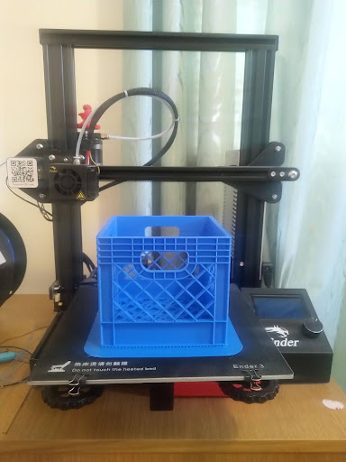

## **Computer Aided Designing(CAD)**

3D CAD is a type of computer software that allows you to create and modify 3D models of objects. There are different types of software you can use for 3D modeling among which a few are [Autodesk Tinkecad(beginner)](https://www.tinkercad.com/), Autodesk Fusion 360(Advanced), SolidWorks(Advanced), [Onshape](https://www.onshape.com/en/), etc. We will be teaching you more about 3D modeling in a different module.

Below You can see the interface of Autodesk interface.

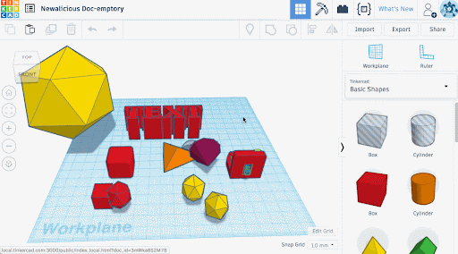

Below links to a  few videos about tinkercad are attached and can see them if you don’t know about 3d modeling but it’s only starting point and you can only work with basic shapes and onshape is the place to go to directly if you are looking to make more complicated things. 
 - [Tinkercad | Learn how to use Tinkercad](https://www.tinkercad.com/learn)
 - [(8) TinkerCAD - Tutorial for Beginners in 9 MINUTES! [ COMPLETE ] - YouTube
](https://www.youtube.com/watch?v=gOs6Mdj7y_4)

## **File Types**
STEP files are commonly used in computer-aided design (CAD)/3D modeling to contain three-dimensional model data for a wide variety of design tasks. While for 3D printing Processes we use STL/OBJ files. 

1. ### **STEP(Standard for the Exchange of Product Data)**'
    - STEP files are a way to exchange 3D model data between different computer programs. They are text-based files that can be read and written by a variety of CAD/3D modeling software applications. like-JPG/PNG file type is used for exchanging images between different Software and devices.
    - This file contains a complete representation of a 3D model, including the geometry, dimensions, and other properties of the model.
2.  ### **STL/OBJ files**
    - STL and OBJ are two types of 3D files. STL files are made up of triangles, while OBJ files can store more information about a 3D model, like materials, textures, and other properties.
    - You can understand it better with an analogy, STL files are like Lego bricks. Each brick is a triangle, and you can put them together to create any shape you want. OBJ files are like a complete Lego set. They have all the bricks you need to build a specific model, plus instructions on how to put it together.

## 3D-Printing Process
By now, you should have a good understanding of 3D models.. The next step in the 3D printing process involves converting the 3D model into a different file format known as G-code. 

This **file(G-code)** contains various properties/parameters for the 3d printer that are essential for printing specific 3d models, but it also provides instructions for the movement of the components of the 3d printer

We will start by learning about softwares that are used for making gcode,We call these softwares slicing software.

- ### Slicing
    Slicing is the process of cutting a 3D model into thin layers so that a 3D printer can print it. The slicer software does this by dividing the model into horizontal slices, like a loaf of bread. It then creates a path for the printer nozzle to follow to print each layer.

    The slicer also determines the printing settings, such as the layer height, print speed, and infill density. You will learn about these setting later in the documentation.

    There are many slicing programs available, but we will be using Orcaslicer. Orcaslicer is a popular choice because it is open-source and customizable.

    -   #### **How to Install Orcaslicer**
        1. Go to github link of [Orcaslicer](https://github.com/SoftFever/OrcaSlicer/releases/tag/v2.2.0)
        2. Scroll down and you will see files for all operating systems. Download the Installer based on the OS and system you are using.
            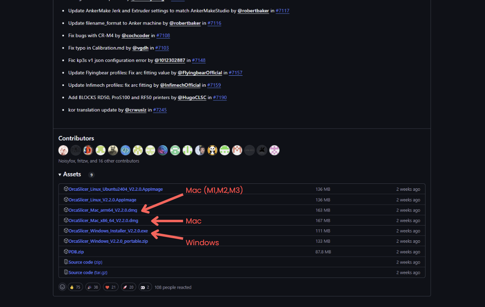
    - #### **Setting Up Orcaslicer**
        1. After Installing the software when you first run it, You will get this kind of a pop up, Follow the steps in video:  
        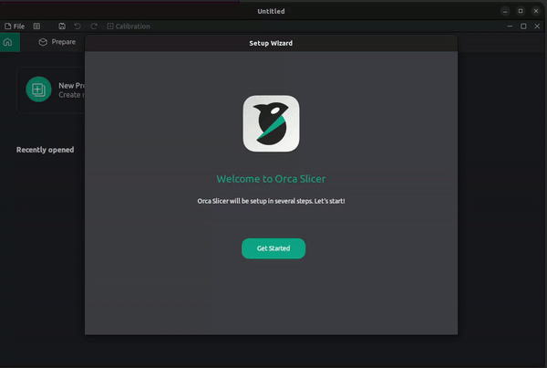

        2. After That, You will see a list of available printers. Select `Ender-3 V2, 0.4 mm Nozzle` from the list and press confirm. It is the printer that we are using.

            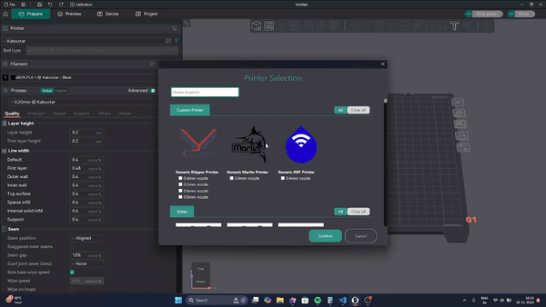

    - #### **Importing Configs**
        1. Go to this Github [Link](https://github.com/SanchakGarg/3DPrintingDocumentation/blob/main/Configs/Configs.zip)
        And download the zip file
        
        2. Extract the zip file and copy all the folders inside it
            
            | Operating System | Instructions |
            | ------------- | -------------|
            |**Windows**|Right click and press extract all and new folder will be created with all the contents of zip file inside it
            |**Mac**| Double click the zip file in and a new folder with the name configs will be created containing all the contents of zip file inside it|  
        3. **There will be 3 folders inside the extracted folder, Copy all of them.**
        4. **Paste the copied folder in the Orcaslicer default folder**

            | Windows | Mac |
            | ------------- | -------------| 
            |1. Press `win + R` key. |1. Press `shift + cmd + g`|
            |2. type `%appdata%` and press enter|2. Copy and Paste `~/Library/Application Support/OrcaSlicer/user/default/` and press enter |
            |3. then go to `OrcaSlicer ➡️ User ➡️ default` and paste all the folders. |3. Paste all the folders that you copied earlier|
        4. Close all the orcaslicer instances and then open it again.
    - #### **Navigating Orcaslicer**
        1. **Preparing the Model to slice**
            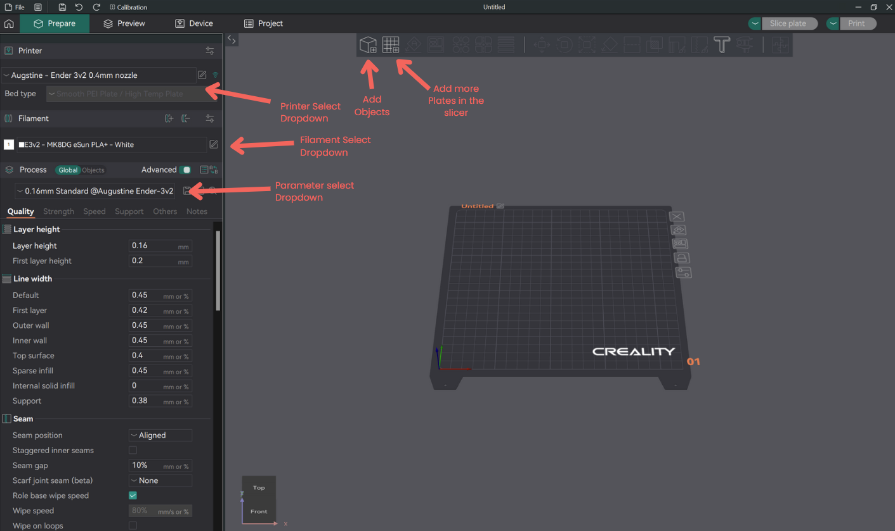    
            - From the printer dropdown, you can select the 3D printer you are printing on. You can do the same on the Filament dropdown, where you can select available filaments based on the color and printer you are using.
            - To add 3D models to the slicer, you can use the first option in the top bar in the middle. In Orcaslicer, you can add `STL`, `OBJ`, and `STEP` files.   
            - **Parameters to set before slicing the model:**
                For obtaining a 3D printed part, there are aspects about the print that need to be decided and informed to the machine before printing. In the event of Fused Deposition Modelling(FDM), there needs to be a few rules and instructions defined for the printer before we can send off our gcode to the machine for execution. These are called “Parameters” of the print. 

                1. **Infill** - Since 3D prints are hollow, we also have to define how much of the space on the inside we wish to fill up with the material we are printing. This is normally expressed as a percentage of the space available inside the innermost perimeter of the print. The main factors it affects is the weight and strength of the print. 
                2. **Supports** -  Supports are temporary structures that hold up overhanging features of a 3D     print. They are needed to prevent overhangs from collapsing, improve surface quality, reduce warping, and increase strength. 
                Supports are typically generated automatically by slicing software, but you can adjust the settings to ensure they are placed and sized correctly.
                3. **Layer Height** -  Layer height in 3D printing refers to the thickness of each layer of plastic laid down by the printer. It directly affects the print quality and print time. Thinner layers (smaller layer height) result in smoother surfaces and finer details but increase the print time. Thicker layers (larger layer height) print faster but may result in a more "stair-stepped" appearance on curved surfaces.

                In the Process section, you can search for infill supports and layer height options, and select configurations for different layer heights based on the printer from the Process dropdown.

                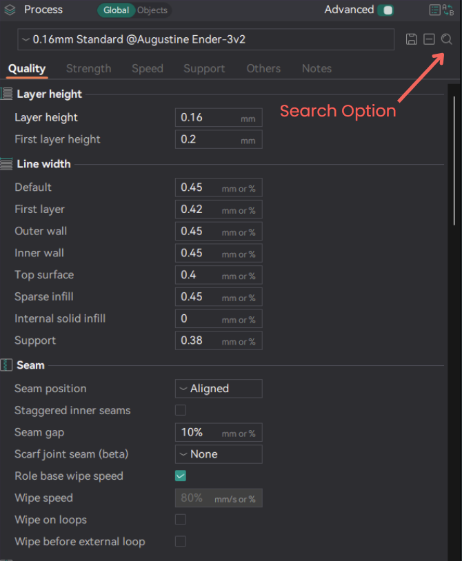
            
        2. **Slicing the 3D model**

            Once your parameters are set, click "Slice" in the top right corner to process your model. You'll then be taken to the preview section.

            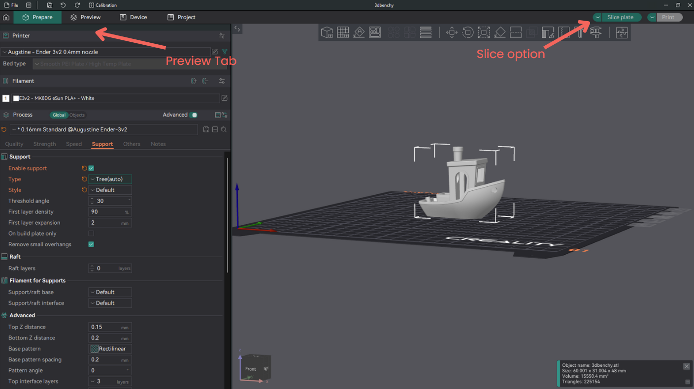

            Below is the preview of sliced model

            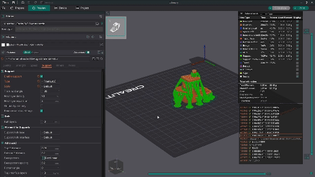

            In the top right corner, you can visualize the various layers of your model, with different colors representing distinct layer types.  Green highlights in the sliced model indicate the support structures automatically generated by the slicer.  Meanwhile, the bottom right corner provides a live view of the G-code commands that are being sent to the 3D printer during the printing that part of the model.
        3. **Sending gcode to printer to print**

            After the model has been sliced, Press the Print Option on the top right corner.

            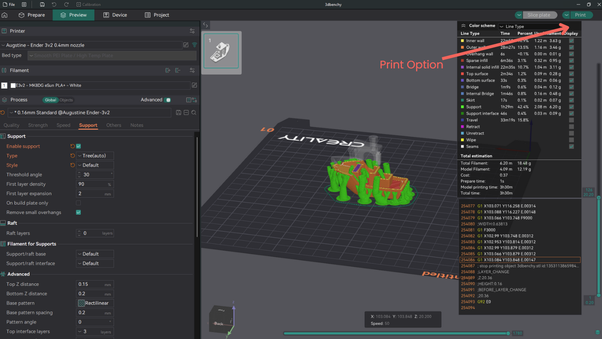

            After Your Click that, you will get a pop up as shown below.

            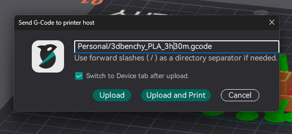

            Make sure to save your file with the `.gcode` extension (e.g., `my_print.gcode`). To organize it into a folder, type the folder name and a `/` before the file name (e.g., `my_prints/my_print.gcode`).

            Then if you want to direcly upload and print then press `Upload and Print` and if you want to just upload then press `Upload`.

            After this your file will be uploaded to printer and you can view the printer dashboard in the device view by clicking on device from the top bar.

            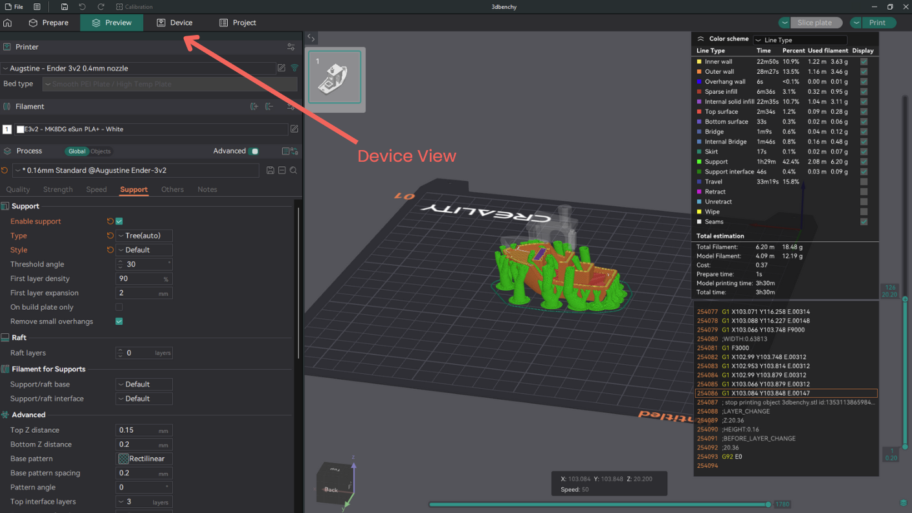
        4. **Printer Dashboard Overview**

            Printer Dashboard we use is called `fluidd`. It provides a user-friendly interface for managing your 3D printer.  It offers real-time monitoring of printing progress, temperatures, and control over various settings.

            Below is an image of the printer

            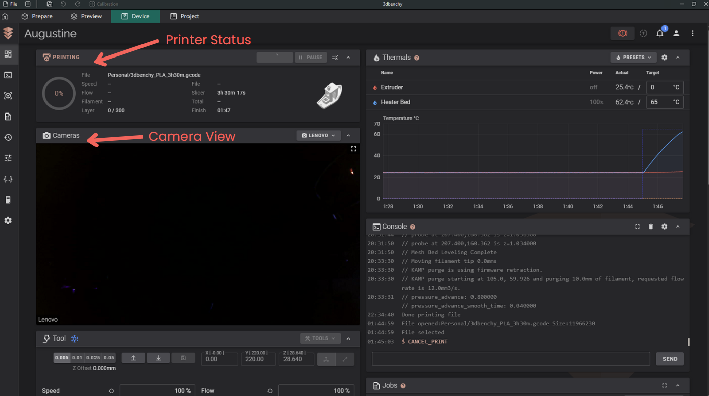
            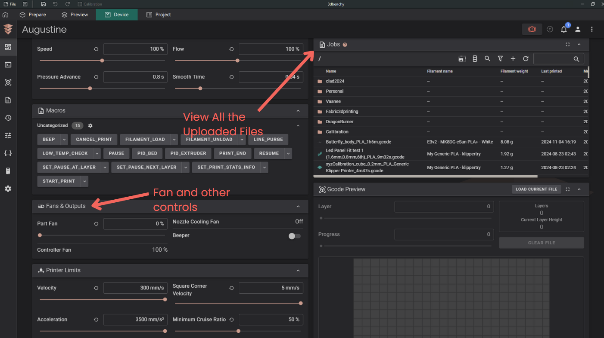

            From tools menu you can control and the motors of the 3d printer

            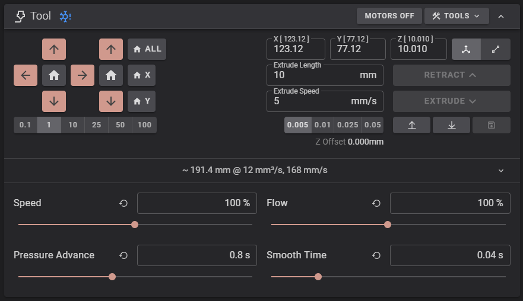

            while there is a print in progress, you will see cancel print and pause print option next to Printer status and if the print is paused then the `pause` option will be replaced by `resume` option.

            

>**Caution**: Avoid pausing your print for extended periods, as this may lead to cancellation or even your prints can also be ruined.

